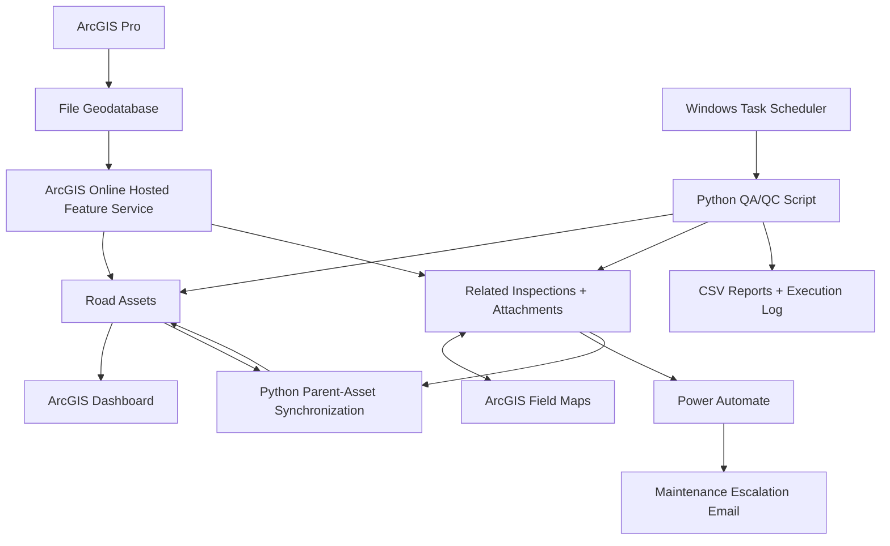
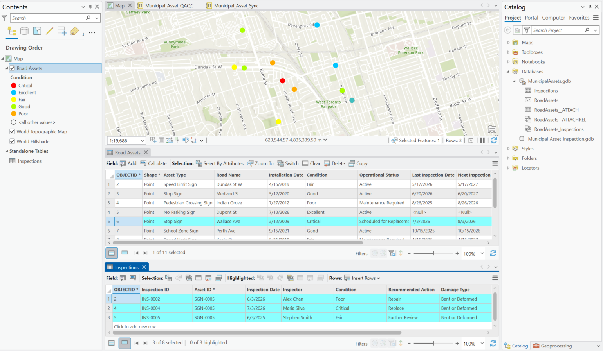
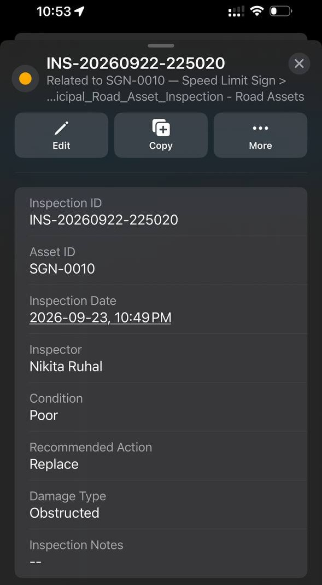
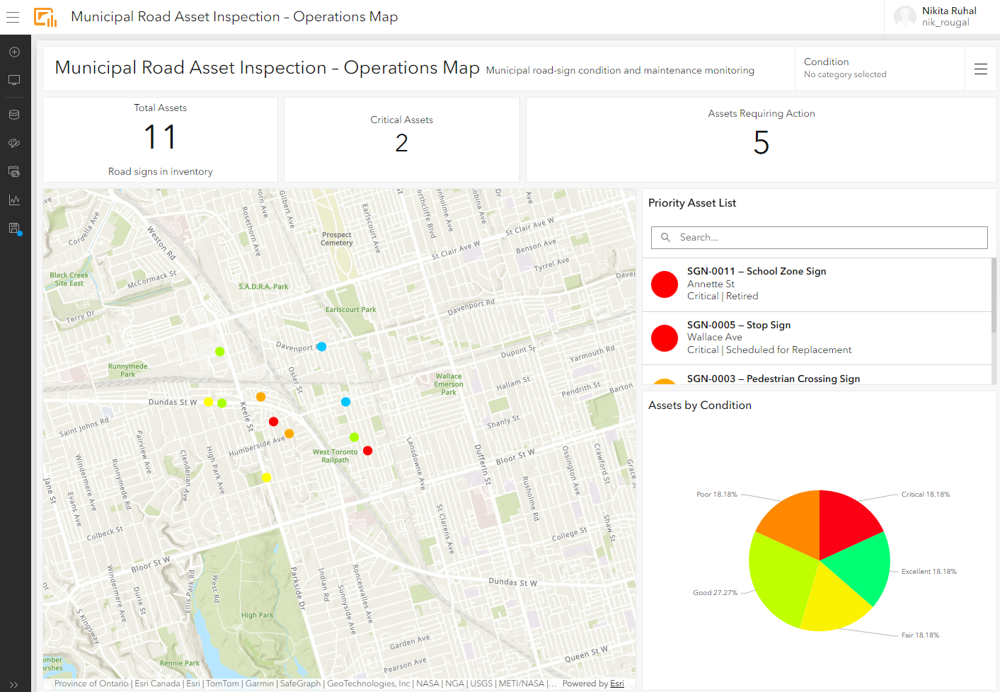
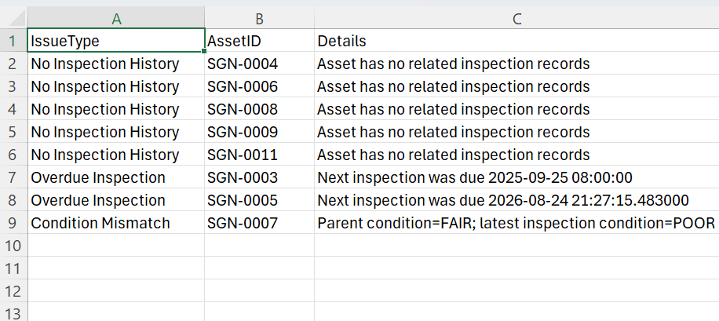
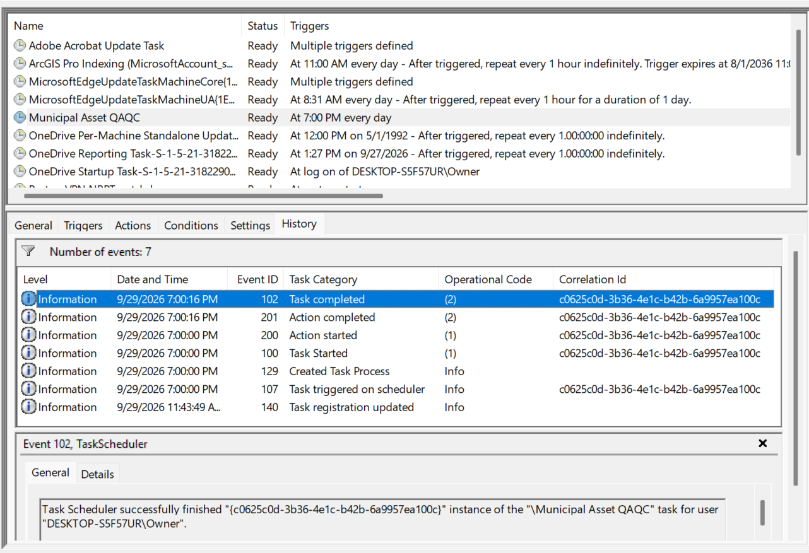
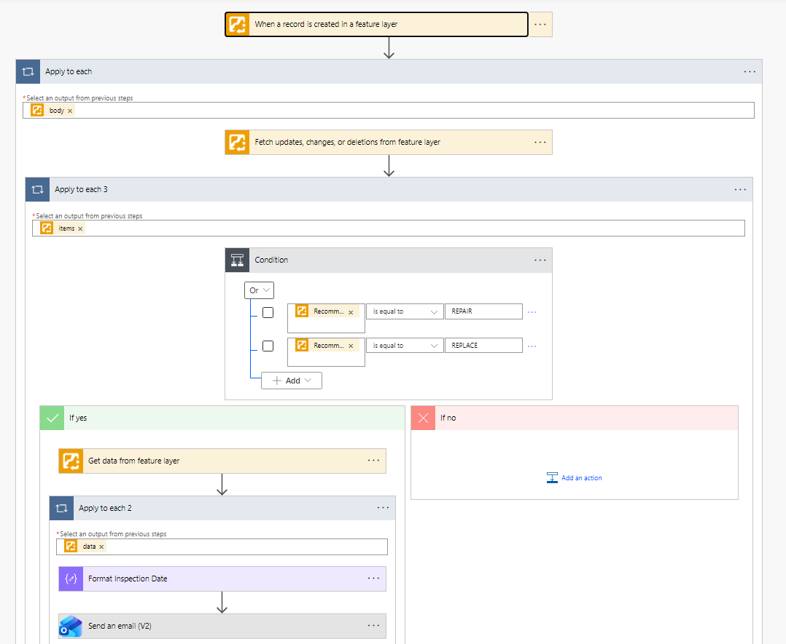
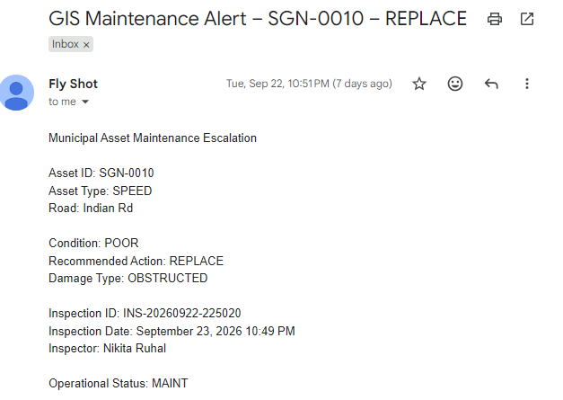

# Municipal Road Asset Inspection & Maintenance Automation

## Overview

Built an end-to-end GIS asset inspection workflow using ArcGIS Pro, ArcGIS Online, ArcGIS Field Maps, Python, Power Automate, and Windows Task Scheduler to manage road-sign inspections, automate maintenance escalation, validate data quality, and support operational monitoring.

This is a portfolio project built with fictional/sample municipal road-asset data.

## What This Project Demonstrates

- GIS data modeling with related asset and inspection records
- Mobile field-data collection with ArcGIS Field Maps
- Hosted GIS workflows in ArcGIS Online
- Operational monitoring with ArcGIS Dashboards
- Python QA/QC and hosted-feature automation
- Event-driven maintenance escalation with Power Automate
- Scheduled unattended Python execution with Windows Task Scheduler

### Demo Dataset

The current demo contains 11 sample road assets and related inspection records created specifically for testing the workflow.

## Business Problem

A municipal operations team needs to maintain an inventory of road signs, collect field inspections, identify assets requiring maintenance or replacement, keep parent asset records synchronized with inspection results, and notify supervisors when urgent action is recommended.

The solution also needs to support ongoing QA/QC so that overdue inspections, inconsistent asset states, missing inspection history, and related-record problems can be identified before they affect operational decisions.

## Solution Architecture



## Key Features

### ArcGIS Pro
- Designed the Road Assets and Inspections schema
- Created coded-value domains for controlled data entry
- Implemented a one-to-many relationship between assets and inspections
- Added GlobalIDs
- Enabled attachments for field photos
- Configured map symbology by asset condition
### ArcGIS Field Maps
- Built a related inspection form
- Automated Inspection ID generation
- Automated Inspector name population
- Added conditional visibility for Damage Type and Recommended Action
- Supported mobile photo collection
- Preserved inspection history against each road asset
### ArcGIS Dashboard
- Total asset count
- Critical asset count
- Assets requiring action
- Condition distribution
- Priority asset list
- Interactive map and condition filtering
### Python Automation
- QA/QC checks against hosted ArcGIS Online data
- Parent/latest-inspection reconciliation
- Selective parent-asset updates
- Business-rule validation
- Audit logging
- Idempotent synchronization logic
### Power Automate
- Listens for newly created inspection records
- Filters inspections recommending REPAIR or REPLACE
- Retrieves the related parent Road Asset
- Converts ArcGIS epoch timestamps into readable local time
- Sends a maintenance escalation email with inspection and asset details
### Windows Task Scheduler
- Runs QA/QC automatically through ArcGIS Pro's propy
- Uses a saved ArcGIS authentication profile
- Produces timestamped CSV reports
- Records execution logs
- Supports unattended scheduled execution

## Data Model
The solution uses two core datasets:

### Road Assets

Each feature represents one road-sign asset.

Key fields include:

- Asset ID
- Asset Type
- Road Name
- Installation Date
- Condition
- Operational Status
- Last Inspection Date
- Next Inspection Date
- Notes
- GlobalID

### Inspections

Each table record represents one inspection event.

Key fields include:

- Inspection ID
- Asset ID
- Inspection Date
- Inspector
- Condition
- Recommended Action
- Damage Type
- Inspection Notes
- GlobalID
- Attachments

### Relationship

A one-to-many relationship connects Road Assets to Inspections:

```text
Road Asset
    1
    |
    |----< Inspections
             many
``` 

## Field Inspection Workflow
The field workflow is centered on ArcGIS Field Maps.

1. An inspector opens an existing road asset.
2. The asset's current condition, operational status, inspection dates, and attachments are displayed.
3. The inspector creates a new related Inspection record.
4. Inspection ID is generated automatically.
5. Inspector name is populated automatically from the signed-in user.
6. Condition is selected from a controlled domain.
7. Damage Type and Recommended Action appear only when relevant.
8. A photo can be added to the inspection.
9. The new record is submitted to ArcGIS Online.

This preserves the historical inspection record while keeping the parent asset inventory separate.

## Dashboard Workflow
The Operations Dashboard provides a management view of the road-sign inventory.

It includes:

- Total Assets
- Critical Assets
- Assets Requiring Action
- Priority Asset List
- Assets by Condition
- Interactive Road Asset map
- Condition filtering

The Dashboard reads from the hosted Road Assets layer, so changes to parent asset condition or status are reflected in the management view.

## Python QA/QC Automation

The QA/QC script connects directly to the ArcGIS Online hosted feature service using the ArcGIS API for Python.

It checks for:

- Duplicate Asset IDs
- Duplicate Inspection IDs
- Assets with no inspection history
- Orphan inspection records
- Missing inspection dates
- Overdue inspections
- Condition/status inconsistencies
- Parent asset condition mismatches with the latest inspection

The script produces a consolidated QA report containing:

- Issue Type
- Asset ID
- Issue Details

Example output:
```text
No Inspection History | SGN-0004 | Asset has no related inspection records
Overdue Inspection    | SGN-0003 | Next inspection date has passed
Condition Mismatch     | SGN-0005 | Parent condition differs from latest inspection
```

## Scheduled QA/QC

The QA/QC notebook logic was converted into a standalone Python script for unattended execution.

Windows Task Scheduler runs the script through ArcGIS Pro's `propy` environment.

The scheduled process:

```text
Windows Task Scheduler
        ↓
propy
        ↓
municipal_asset_qaqc.py
        ↓
ArcGIS Online Hosted Data
        ↓
QA/QC Checks
        ↓
Timestamped CSV Report
        +
Execution Log
```

## Parent Asset Synchronization

A separate Python workflow compares each Road Asset with its latest related Inspection.

The script can update:

- Condition
- Operational Status
- Last Inspection Date
- Next Inspection Date

Business rules are applied based on the latest inspection condition and recommended action.

Example rules:

| Condition | Recommended Action | Parent Status |
|---|---|---|
| Excellent / Good / Fair | No Action / Further Review | Active |
| Any non-retired asset | Clean / Repair | Maintenance Required |
| Poor / Critical | Repair | Maintenance Required |
| Critical | Replace | Scheduled for Replacement |
| Any | Existing Retired status | Remains Retired |

These rules are demonstration business rules used to test synchronization logic and are not intended to represent municipal standards.

The synchronization process uses:

- dry-run review
- selective field updates
- audit logging
- idempotent execution

If the hosted parent data is already synchronized, rerunning the script produces zero unnecessary updates.

> The QA/QC script is scheduled automatically through Windows Task Scheduler. The parent-asset synchronization script remains a controlled administrative workflow and is not scheduled in this demo.

## Power Automate Maintenance Escalation

A Power Automate flow handles urgent inspection events.

The workflow:
```text
New Inspection Record
        ↓
Fetch ArcGIS Changes
        ↓
Recommended Action?
   REPAIR / REPLACE
        ↓
Retrieve Parent Road Asset
        ↓
Format Inspection Date
        ↓
Send Maintenance Alert Email
```
The maintenance email includes:

- Asset ID
- Asset Type
- Road Name
- Condition
- Recommended Action
- Damage Type
- Inspection ID
- Inspection Date
- Inspector
- Operational Status

Only inspections that meet the escalation criteria proceed to the notification step.

## Technology Stack

### GIS
- ArcGIS Pro
- ArcGIS Online
- ArcGIS Field Maps
- ArcGIS Dashboards

### Development
- Python
- pandas
- ArcGIS API for Python
- Arcade

### Automation
- Microsoft Power Automate
- Windows Task Scheduler

### Data
- File Geodatabase
- Hosted Feature Layers
- Relationship Classes
- Coded-Value Domains
- GlobalIDs
- Attachments

## Challenges and Lessons Learned

### Local vs Hosted Data
After publishing the project to ArcGIS Online, the hosted feature layer became the operational source of truth. Changes made to the original local geodatabase were not automatically reflected online.

### Relationship-Based Field Collection
Using related Inspection records allowed the system to preserve inspection history instead of overwriting the parent Road Asset after every visit.

### Database Field Naming
During development, one field was created with the internal name `AsssetID`. Because multiple downstream components already depended on it, the internal field name was preserved while the user-facing alias remained `Asset ID`.

The Python scripts handle the internal schema explicitly through field-name constants.

### ArcGIS Domain Codes
ArcGIS APIs and Power Automate may expose coded domain values such as:

```text
POOR
REPLACE
MAINT
```

while Field Maps displays user-friendly descriptions such as:

```text
Poor
Replace
Maintenance Required
```
This required distinguishing stored codes from display labels during automation.

### ArcGIS Date Handling
ArcGIS returned inspection dates to Power Automate as Unix epoch timestamps in milliseconds.

An expression was added to convert the value into Eastern Time and format it as a readable date/time.

### Idempotent Automation
The parent synchronization script was designed so that rerunning it against already synchronized data produces no unnecessary updates.

### Power Automate Licensing and Email Delivery
The ArcGIS Power Automate connector required Premium access.

An inactive Microsoft 365 business mailbox also prevented the original Outlook connector from delivering messages, so the workflow was switched to a working Outlook.com connection for development and testing.

### ArcGIS Online Notebook Privileges
The available ArcGIS organizational role allowed notebook items to be uploaded but did not provide the privileges required to execute or schedule ArcGIS Online Notebooks.

Windows Task Scheduler was therefore used to demonstrate unattended Python automation.

## Repository Structure
```text
municipal-road-asset-gis/
├── .gitignore
├── CONFIGURATION.md
├── README.md
├── docs/
│   ├── architecture.png
│   ├── field-maps.png
│   ├── dashboard.png
│   ├── maintenance-email.png
│   ├── qaqc-report.png
│   └── task-scheduler.png
├── python/
│   ├── municipal_asset_qaqc.py
│   └── municipal_asset_sync.py
├── sample-output/
│   ├── GIS_Data_Quality_Report_sample.csv
│   └── qaqc_scheduler_sample.log
└── LICENSE

```

## Screenshots

**Data Model / Related Records**


**Field Maps Inspection Workflow**


**Operations Dashboard**


**Python QA/QC**


**Scheduled QA/QC**


**Power Automate Maintenance Escalation**


**Maintenance Alert**


## Future Improvements

Potential next steps for a production implementation include:

- Replace sample road-sign data with authoritative municipal asset data
- Run Python automation on an always-on server or cloud automation platform
- Store QA/QC issues in a hosted ArcGIS table instead of CSV only
- Add QA/QC trends to the Dashboard
- Create formal maintenance work-order records instead of email-only escalation
- Add role-based access for field inspectors, supervisors, and administrators
- Add offline Field Maps support
- Add asset lifecycle and replacement-history tracking
- Integrate work-order completion back into the GIS
- Replace development credentials and connections with dedicated production service accounts
- Move parent-asset synchronization to an event-driven or server-hosted production process

## Project Scope and Disclaimer

This project was built as a portfolio and learning project using fictional/sample municipal road-sign data.

It is intended to demonstrate GIS data modeling, field data collection, hosted GIS workflows, Python automation, QA/QC, dashboard development, and business-process integration.

The maintenance rules, inspection intervals, and escalation logic are demonstration rules and should not be interpreted as official municipal engineering or asset-management standards.